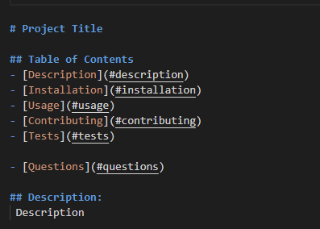
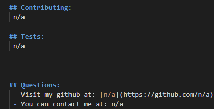
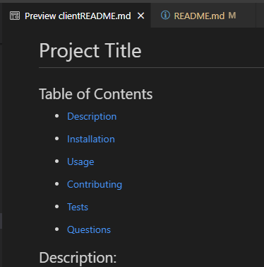
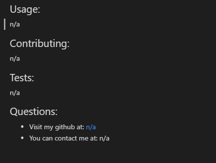

# README Generator
Repo Link: https://github.com/sdoval27/readme-generator

## Description:
This project uses inquirer and nodeJS to quickly create README.md files.

## Usage:
By answering the questions displayed through inquirer, developers can quickly generate README files for their coding projects.

- If a user project doesn't include a license, then the resulting README file will not include a badge, and the license section will not display in the table of contents or README file.
- This is how the raw markdown will appear:

 

- This is how the README will display:

 

## License:
 [MIT](https://www.gnu.org/licenses/old-licenses/gpl-2.0.en.html)
